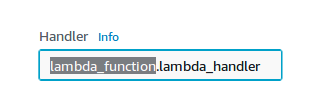

# Marvel-Fun-Facts

This is a simple Alexa skill made in Python, just to give you an idea of how to make a skill as Python as your runtime environment.

#### Change your environment
When you make your lambda function, make sure you select your runtime as python.

You also need to make sure that the name of your python file matches with the one in your handler.

And similarly the lambda_handler in `lambda_handler` in your code should match with the same in your handler.

